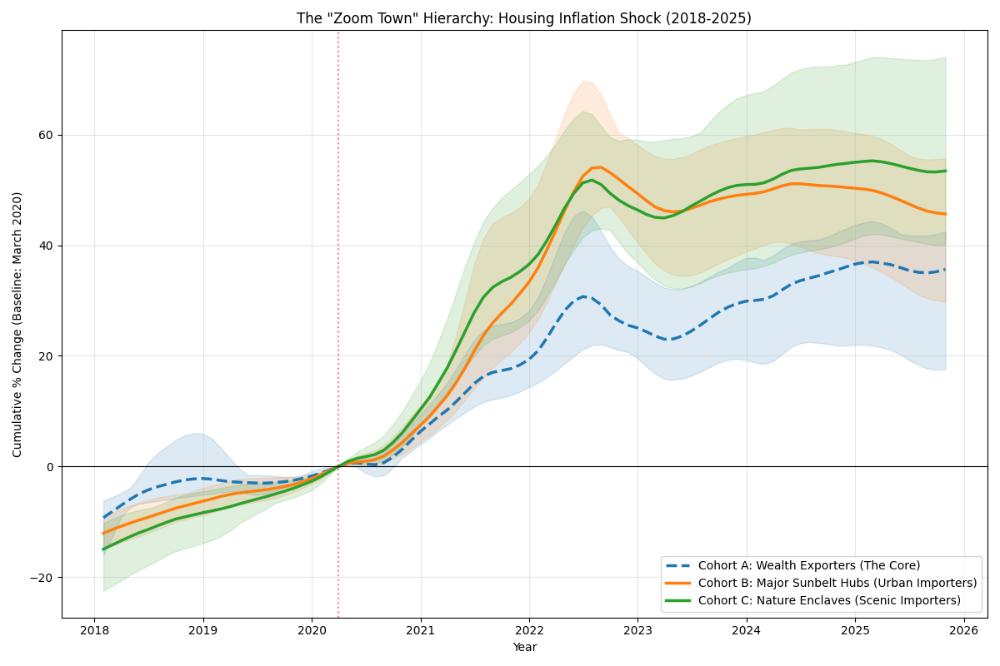
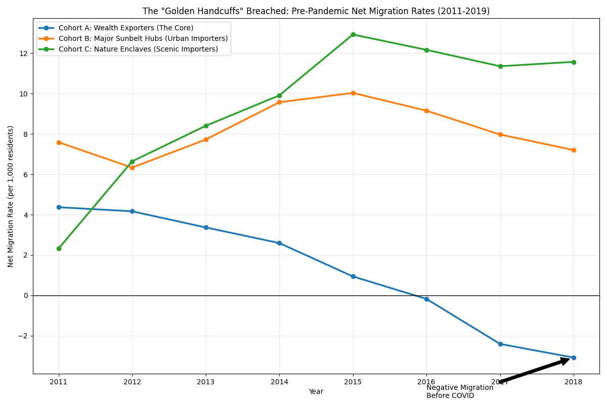

# The Great Reshuffling: Quantifying Remote Work Inflationary Shocks

### Project Overview
This project quantifies the "Inflationary Externality" of remote work migration on US housing markets. By engineering a data pipeline that merges Zillow (ZHVI) and Census migration data, I modeled the wealth transfer from "Superstar Cities" to "Zoom Towns" between 2019 and 2025.

**The Core Question:** Did remote work creating a "Lifestyle Premium" in housing markets, and was this shock driven by supply constraints?

### Key Findings
1.  **The Lifestyle Premium:** Supply-constrained "Nature Enclaves" (e.g., Bozeman, MT) experienced the highest inflation (**+53.5%**), outperforming urban Sunbelt hubs (**+45.7%**).
2.  **The Structural Break:** Census analysis confirms that coastal cities were losing population *before* 2020, yet prices rose. This proves that "Golden Handcuffs" (job location) supported prices until remote work broke the link.

### Repository Structure
* `src/analysis_zoom_hierarchy.py`: **(Core Analysis)** Main ETL pipeline. Fetches Zillow data, segments cities into 3 cohorts (Core, Sunbelt, Nature), and calculates the cumulative inflation gap.
* `src/fetch_migration_history.py`: **(Mechanism Validation)** Fetches Census API data (2011-2019) to prove the "Golden Handcuffs" theory regarding pre-pandemic migration.
* `src/analysis_pre_trend_housing.py`: **(Robustness Check)** Runs a "Placebo Test" on 2010-2019 data to validate Parallel Trends assumptions.
* `output/`: Generated charts and summary statistics.

### Visualizations
| The Inflation Shock (2020-2025) | The "Golden Handcuffs" (2011-2019) |
|:---:|:---:|
|  |  |
| *Nature Enclaves (Green) overtake Sunbelt (Orange)* | *SF/NY (Blue) lose people while prices rise* |

### Technical Implementation
* **ETL:** Automated ingestion of CSVs via `requests` and fuzzy-matching logic to map Zillow RegionNames (e.g., "Bend-Redmond, OR") to analysis cohorts.
* **Econometrics:** Utilized a Difference-in-Differences framework with time-series normalization ($t=0$ at March 2020).
* **Visualization:** `Matplotlib` with confidence intervals (shaded error bands) to visualize intra-cohort variance.

### How to Run
1. Install dependencies: `pip install pandas matplotlib requests`
2. Run the main analysis: `python src/analysis_zoom_hierarchy.py`
